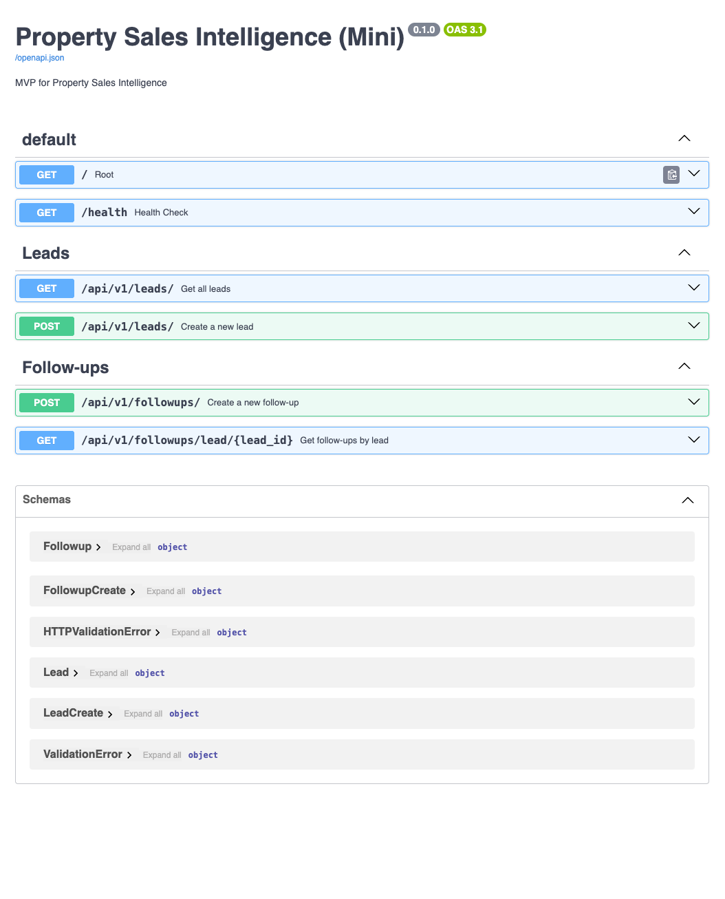

<p align="center">
  
</p>

<h1 align="center">DscienTia Core</h1>

<p align="center">
  <strong>Decision Intelligence Infrastructure for Real-World Impact</strong>
</p>

<p align="center">
  DscienTia Core is a data-driven decision intelligence platform designed to
  support ethical governance, explainable recommendations, and scalable
  analytics — starting with Property Sales as its first vertical.
</p>

<p align="center">
  Built for transparency · governance · real-world deployment
</p>

---

## 🚀 Overview

**DscienTia Core** is a modular, governance-first decision intelligence platform designed to transform raw operational data into **explainable, auditable, and persona-aware recommendations**.

This repository implements **Property Sales Intelligence** as the first vertical, serving as a real-world use case for the DscienTia Core architecture.

DscienTia Core is built for:
- Decision transparency
- Governance & auditability
- Human-in-the-loop approval
- Future AI & Web3 extensibility

---

## 🧠 Core Principles

- **Vertical-first architecture**  
  Business logic lives in domain verticals, not in the core.

- **Governance by design**  
  Every decision can be logged, reviewed, approved, and audited.

- **Persona-aware intelligence**  
  Recommendations adapt to Founder, Sales Manager, and Operations roles.

- **Explainability over black-box AI**  
  Decisions are traceable, not opaque.

---

## 🏗️ Project Architecture


```text
├── app/ # Backend (FastAPI)
│ ├── main.py
│ ├── config.py
│ ├── database.py
│ │
│ ├── core/ # Vertical-agnostic intelligence layer
│ │ ├── auth/ # RBAC, security, dependencies
│ │ ├── governance/ # Audit, approval, policies
│ │ ├── decision/ # Scoring, confidence, explainability
│ │ └── personas/ # Persona registry & weighting
│ │
│ ├── verticals/
│ │ └── property_sales/ # First vertical implementation
│ │ ├── api.py
│ │ ├── rules.py
│ │ ├── scoring.py
│ │ ├── schemas.py
│ │ └── service.py
│ │
│ ├── api/
│ │ └── v1/ # HTTP API layer (routing only)
│ │
│ ├── models/ # SQLAlchemy models
│ └── schemas/ # Pydantic schemas
│
├── ui/ # Streamlit UI
│ ├── streamlit_app.py
│ ├── pages/
│ ├── components/
│ └── state.py
│
├── tests/ # Unit & rule tests
├── docs/ # Design & governance docs
├── assets/ # Images & diagrams
└── README.md
```


---

## 🔑 Key Features

### Decision Intelligence
- Risk scoring
- SLA breach detection
- Persona-weighted recommendations
- Confidence scoring

### Governance & Trust
- Full audit trail
- Human approval flow
- Explainability metadata
- Cache & decision trace control

### UX & Operations
- Modular Streamlit dashboard
- Persona selector
- Ingestion monitoring
- Data quality indicators

---

## 🧩 Property Sales Vertical (v1)

The **Property Sales** vertical demonstrates how DscienTia Core can be applied to a real business domain.

**Capabilities:**
- Lead ingestion (CRM, WhatsApp, Ads – mock & extensible)
- Risk & SLA analysis
- Persona-based action recommendations
- Governance-ready decisions

This vertical acts as a **reference blueprint** for future domains.

---

## 🔐 Authentication & RBAC

- Role-based access control (RBAC)
- Roles: `Founder`, `Sales Manager`, `Operations / CRM`, `Viewer`
- Governance-sensitive actions require approval
- DEV_MODE available for local testing

---

## ▶️ Running the Project

### Backend
```bash
uvicorn app.main:app --reload
```

---

Frontend (Streamlit)
```bash
streamlit run ui/streamlit_app.py
```

---

🧪 Testing
```bash
pytest tests/
```
Includes:

Rule validation

Persona weighting tests

Scoring logic tests

---

Open your browser at:
http://127.0.0.1:8000/docs

<!-- Replace 'app_screenshot.png' with your actual file name -->

*Figure: Application Interface / API Documentation*

---

🧭 Roadmap

Multi-vertical support (NGO, Education, Public Sector)

Advanced explainability layers

Web3-ready audit anchoring

AI-assisted decision copilots

Plugin system for new domains

---

🌍 Vision

DscienTia stands for:

Data Science for Justice, Intelligence, and Transformation

This project is not just about analytics —
it is about building trustworthy decision systems for complex social and economic environments.

---

📜 License

MIT License (initially)
Governance extensions may introduce additional policies in the future.


⬆️ **END OF README** ⬆️
